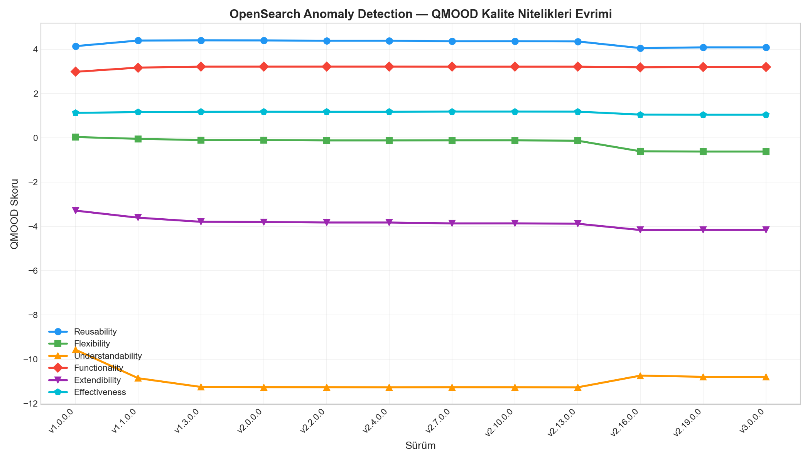
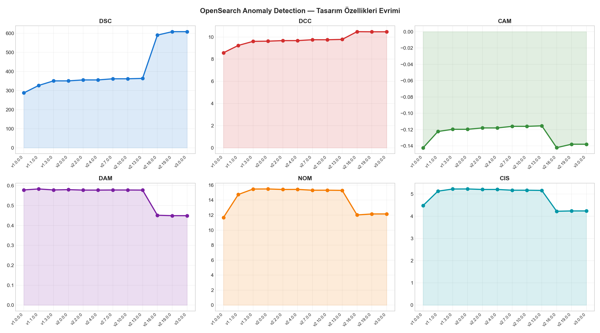
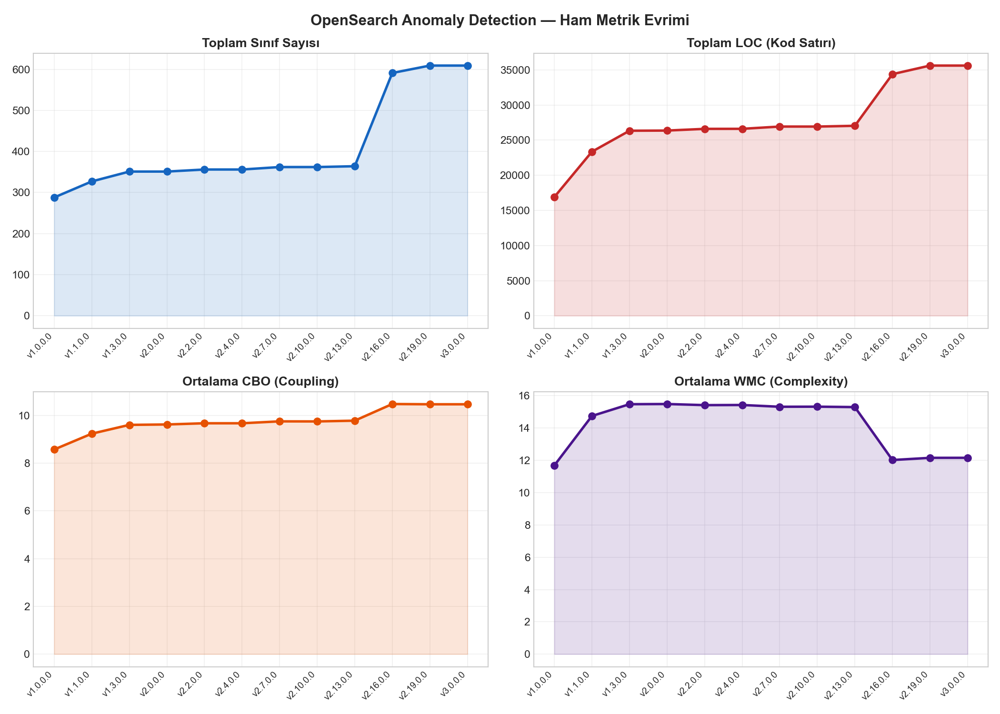
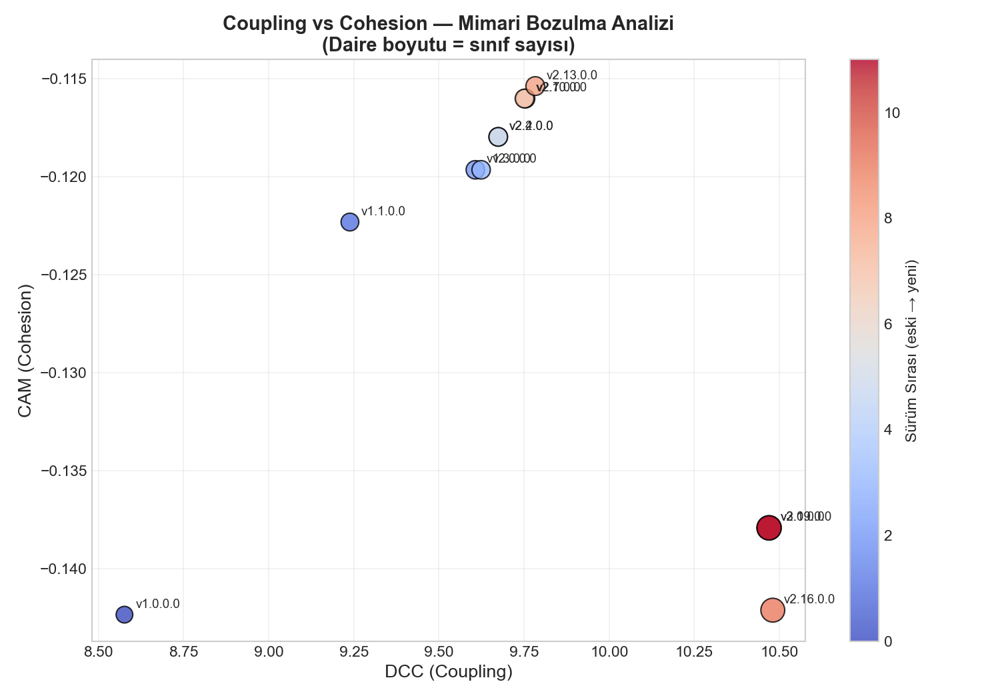
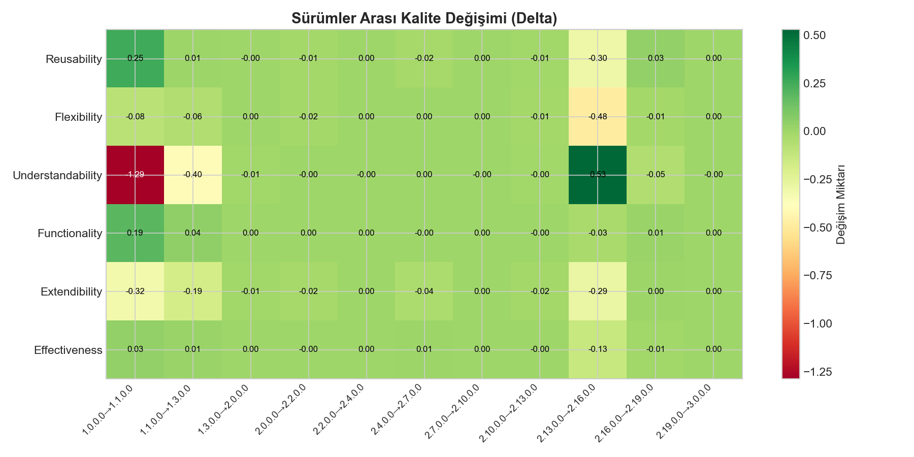
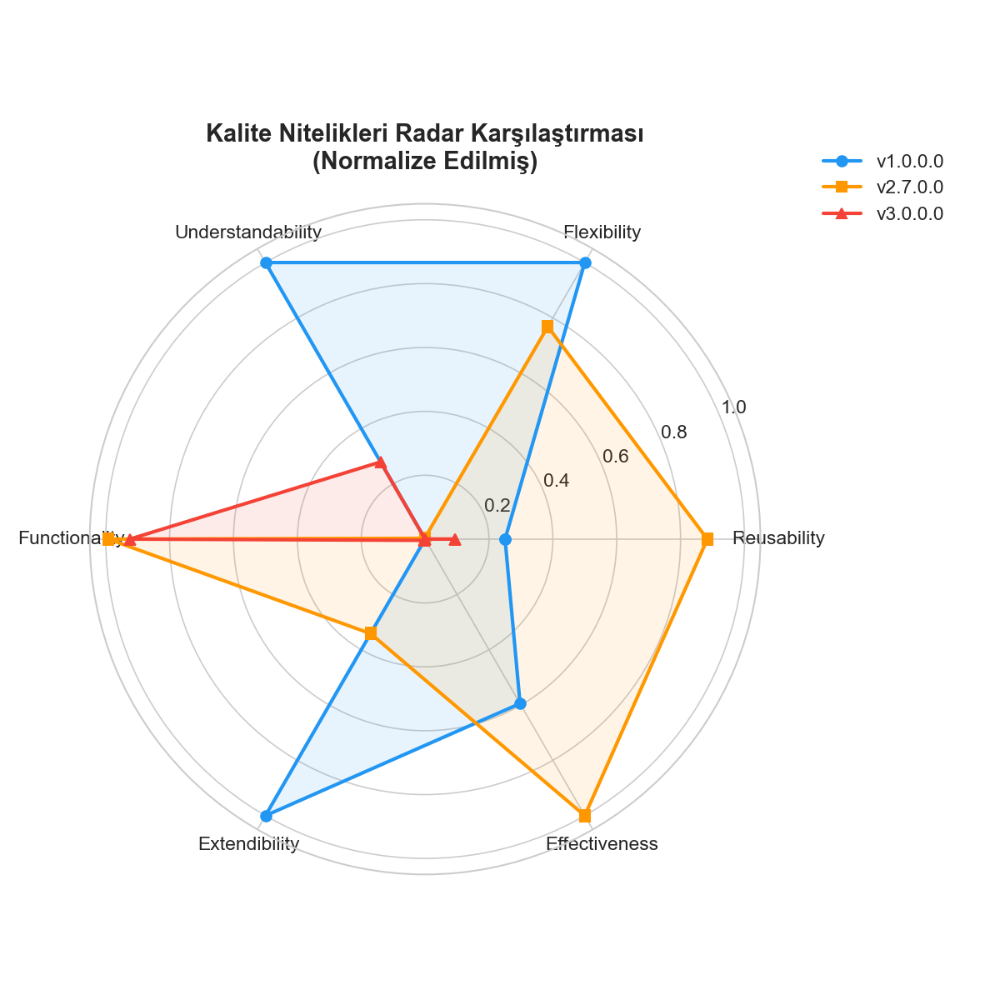

# QMOOD Tabanli Yazilim Kalitesi Analizi ve LLM Destekli Degerlendirme

## OpenSearch Anomaly Detection Uzerine Ampirik Bir Calisma

**Ders:** Yazilim Mimarileri ve Tasarim Yontemleri — Donem Projesi

---

## Proje Ozeti

Bu projede, acik kaynak kodlu [OpenSearch Anomaly Detection](https://github.com/opensearch-project/anomaly-detection) projesinin **12 farkli surumu** uzerinde **QMOOD (Quality Model for Object-Oriented Design)** modeli kullanilarak sistematik bir yazilim tasarim kalitesi analizi gerceklestirilmistir.

Calismanin ikinci asamasinda, elde edilen metrik verileri **ChatGPT (GPT-4)**, **Google Gemini** ve **Claude (Anthropic)** olmak uzere uc farkli Buyuk Dil Modeli'ne (LLM) sunulmus ve modellerin yazilim kalitesi degerlendirme yetenekleri karsilastirilmistir.

## Temel Bulgular

| Bulgu | Detay |
|-------|-------|
| Yazilim buyumesi kaliteyi etkiler | 288 siniftan 609 sinifa (%111 artis), Extendibility %26.6 dusus |
| Coupling en kritik sorun | CBO: 8.58 → 10.47 (%22.1 artis), Max CBO = 217 |
| v2.16 kirilma noktasi | 227 yeni sinif, WMC dusus ama DAM %22 azalma |
| LLM'ler metrik analizinde kullanisli | 3 model trendleri dogru yorumladi |
| Prompt muhendisligi kritik | Ham metrik + delta + spesifik soru = derin cikti |

## Analiz Edilen Surumler

| # | Surum | Sinif | LOC |
|---|-------|-------|-----|
| 1 | 1.0.0.0 | 288 | 16,903 |
| 2 | 1.1.0.0 | 327 | 23,354 |
| 3 | 1.3.0.0 | 351 | 26,338 |
| 4 | 2.0.0.0 | 351 | 26,363 |
| 5 | 2.2.0.0 | 356 | 26,604 |
| 6 | 2.4.0.0 | 356 | 26,610 |
| 7 | 2.7.0.0 | 362 | 26,932 |
| 8 | 2.10.0.0 | 362 | 26,930 |
| 9 | 2.13.0.0 | 364 | 27,041 |
| 10 | 2.16.0.0 | 591 | 34,392 |
| 11 | 2.19.0.0 | 609 | 35,613 |
| 12 | 3.0.0.0 | 609 | 35,612 |

## Proje Yapisi

```
software_design_project/
├── README.md                      # Bu dosya
├── rapor.pdf                      # Teknik rapor (IEEE formati, PDF)
├── rapor.tex                      # Teknik rapor (LaTeX kaynak)
├── rapor.md                       # Teknik rapor (Markdown)
├── sunum.pptx                     # Sunum dosyasi (8 slayt, konusmaci notlariyla)
│
├── extract_metrics.sh             # CK Tool otomasyon scripti
├── qmood_analysis.py              # QMOOD hesaplama ve gorsellesstirme
├── create_presentation.py         # Sunum olusturma scripti
│
├── llm_prompt.txt                 # LLM'lere gonderilen standart prompt
├── chatgpt_response.md            # ChatGPT (GPT-4) tam yaniti
├── gemini_response.md             # Google Gemini tam yaniti
├── claude_response.md             # Claude (Anthropic) tam yaniti
│
├── metrics/                       # Surum bazli CK Tool ciktilari
│   ├── 1.0.0.0/class.csv
│   ├── 1.1.0.0/class.csv
│   ├── ...
│   └── 3.0.0.0/class.csv
│
├── results/                       # Hesaplanan tablolar ve grafikler
│   ├── quality_attributes.csv     # QMOOD kalite nitelikleri
│   ├── design_properties.csv      # QMOOD tasarim ozellikleri
│   ├── raw_metrics.csv            # Ham CK metrikleri ozeti
│   ├── quality_delta.csv          # Surumler arasi degisim
│   ├── analysis_data.json         # Tum veriler (JSON)
│   ├── quality_attributes_evolution.png
│   ├── design_properties_evolution.png
│   ├── raw_metrics_evolution.png
│   ├── quality_delta_heatmap.png
│   ├── quality_radar_comparison.png
│   └── coupling_vs_cohesion.png
│
├── proje_odevi.md                 # Ders proje yonergesi
└── proje_todo.md                  # Yapilacaklar listesi (ilerleme takibi)
```

## Gorsellesstirmeler

### QMOOD Kalite Nitelikleri Evrimi


### Tasarim Ozellikleri Evrimi


### Ham Metrik Evrimi


### Coupling vs Cohesion — Mimari Bozulma Analizi


### Surum Arasi Kalite Degisimi (Delta Heatmap)


### Kalite Nitelikleri Radar Karsilastirmasi (v1.0 vs v2.7 vs v3.0)


## Yontem

1. **Metrik Cikarimi:** CK Tool (v0.7.0) ile 12 surumun `src/main/java` dizini analiz edildi
2. **QMOOD Hesaplama:** 10 tasarim ozelligi ve 6 kalite niteligini Bansiya & Davis (2002) formulleriyle hesapladik
3. **Gorsellesstirme:** Matplotlib ile 6 profesyonel grafik uretildi
4. **LLM Degerlendirme:** Ayni prompt ile ChatGPT, Gemini ve Claude'dan analiz istendi
5. **Karsilastirma:** LLM ciktilari elestirel olarak karsilastirildi ve metrik bulgulariyla harmanlandi

## Kullanilan Araclar

| Arac | Surum | Amac |
|------|-------|------|
| CK Tool | 0.7.0 | Java metrik cikarimi |
| Python | 3.12.1 | QMOOD hesaplama, analiz |
| Pandas | — | Veri isleme |
| NumPy | — | Sayisal hesaplamalar |
| Matplotlib | — | Gorsellesstirme |
| Java | 22.0.1 | CK Tool calistirma |

## LLM Karsilastirmasi Ozeti

| Alan | ChatGPT (GPT-4) | Gemini | Claude |
|------|---------|--------|--------|
| Yaklasim | Dengeli, pratik | Elestirel, risk odakli | Sistematik, nicel |
| Teknik borc | Orta | Yuksek | Orta-Yuksek |
| v2.16 yorumu | "Borcun turu degismis" | "Katilasmis (rigid)" | "Paradoksal iyilesme" |
| v3.0 yorumu | "Kararli durum" | "Inovasyon kaybi" | "Donma noktasi" |
| Mimari tani | Iyi ayristirmis, siki entegre | Big Ball of Mud → Dist. Spaghetti | Organik buyume → donusum |

## Kaynaklar

1. Bansiya, J. & Davis, C. G. (2002). A Hierarchical Model for Object-Oriented Design Quality Assessment. *IEEE TSE*, 28(1), 4-17.
2. Chidamber, S. R. & Kemerer, C. F. (1994). A Metrics Suite for Object-Oriented Design. *IEEE TSE*, 20(6), 476-493.
3. Lehman, M. M. (1996). Laws of Software Evolution Revisited. *EWSPT*, 108-124.
4. Fan, A. et al. (2023). Large Language Models for Software Engineering. *arXiv:2310.03533*.
5. Aniche, M. (2015). CK Tool. [GitHub](https://github.com/mauricioaniche/ck)

## Lisans

Bu proje akademik bir donem projesidir.
